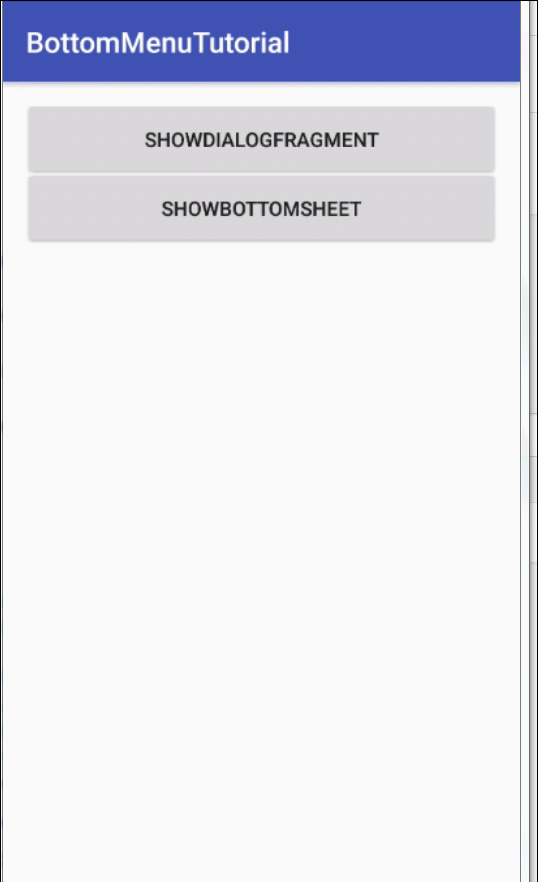

# **此项目主要就是开发过程中的技术预演写的一些demo**

## 各模块的介绍

- 1.BottomMeun模块

> 封装的仿ios底部弹窗,BottomDialog

> BottomSheetBehavior的应用 可滑动的底部弹窗

- 2.app模块

> 集成腾讯mars  Xlog高性能日志,并封装,可直接使用

- 3.MVPTest模块

> MVP框架的应用 适合练手

- 4.eventbusdemo模块

> eventbus库的应用

- 5.sqldemo模块

> 对数据库的操作和点击水波纹效果的实现及倒计时的实现

- 6.华为推送demo

